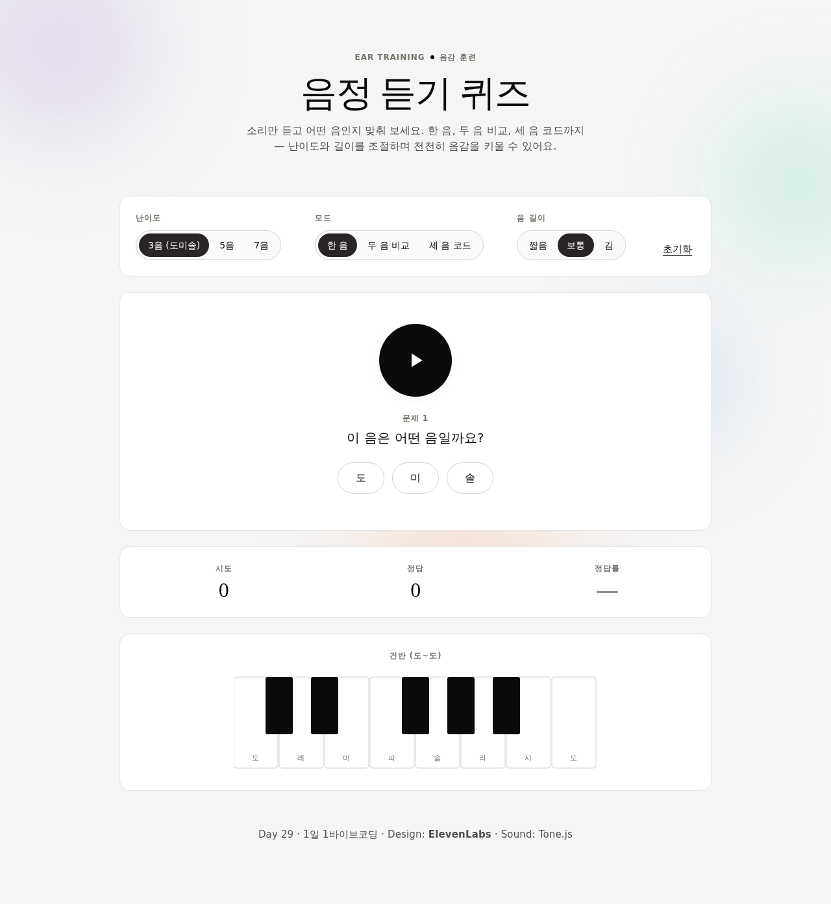

# Day 29 · 음정 듣기 퀴즈 (Pitch Ear-Training Quiz)

> 1일 1바이브코딩 · 100개 토픽 중 #029 (음악)
> 초등 4~6학년 음감 기초 훈련. 한 음, 두 음 비교, 세 음 코드 듣고 어떤 음·관계·화음인지 맞춰 보세요.

🔗 라이브: <https://989-alt.github.io/project-29-eumjeong-deutgi-kwijeu/>



## 핵심 기능

- **난이도 3단계** — 3음 (도·미·솔) / 5음 (도·레·미·솔·라) / 7음 (도~시) — 선택지 개수가 함께 변경
- **모드 3종 전환** — 한 음 인식 / 두 음 비교 (같다·올라감·내려감) / 세 음 코드 (장3·단3·sus4·감3, 난이도별 가짓수 가변)
- **음 길이 조절** — 짧음 (0.6초) / 보통 (1.0초) / 김 (1.5초)
- **점수·정답률 실시간** — 시도, 정답, 정답률 % 표시. 초기화 버튼 1개
- **건반 시각화** — 답 공개 시 정답 음이 건반에 mint 그라디언트로 일시 강조
- **다시 듣기 / 다음 문제** — 정/오 피드백 직후 같은 문제 재생 또는 새 문제 전개
- **휘발성 점수만** — 새로고침 시 초기화. 서버·DB·로그인 없음 (개인정보 0)

## 실행 방법

별도 빌드 단계 없음. 단일 HTML.

```bash
# 1) 클론
git clone https://github.com/989-alt/project-29-eumjeong-deutgi-kwijeu.git
cd project-29-eumjeong-deutgi-kwijeu

# 2) 정적 서버
python3 -m http.server 5181 --bind 127.0.0.1

# 3) 브라우저
open http://127.0.0.1:5181/
```

또는 GitHub Pages 라이브 링크에 바로 접속.

## 기술 스택

- **HTML/CSS/JS** — 단일 `index.html`, vanilla CSS, vanilla JS
- **[Tone.js](https://tonejs.github.io)** (CDN, unpkg) — 음 합성 (PolySynth + triangle wave)
- **EB Garamond + Inter** (Google Fonts) — Waldenburg 대체 + 본문
- **빌드 없음** — GitHub Pages root에서 그대로 호스팅

## 디자인

**Brand: ElevenLabs** (from `awesome-design-md` collection)

- Off-white canvas `#f5f5f5` + warm near-black ink `#0c0a09` — editorial print-magazine feel
- Display: EB Garamond at weight 400 (Waldenburg Light 대체)
- Body: Inter 400/500, +0.16px letter-spacing
- CTA: 잉크 알약 (`#292524`, rounded-pill)
- 시그니처 atmospheric orbs: mint / peach / lavender / sky 그라디언트가 배경에 부유 (장식 only, 컴포넌트 채움색 아님)
- 정답 강조: mint orb halo · 오답 표기: rose orb halo (색 + 텍스트 라벨 동시 사용)

## 접근성

- 키보드 조작 가능 (Tab 이동, ← → 세그먼트 전환, Enter로 다음 문제)
- 모든 인터랙티브 요소에 `aria-label` / `aria-pressed` / `role="status"` 라이브 영역
- 명도 대비: 본문 #4e4e4e on #f5f5f5 ≈ 7.4:1 (WCAG AAA)
- `prefers-reduced-motion` 시 orb 드리프트 중지
- 색만으로 정/오 구분하지 않음 — "정답!" / "오답" 텍스트 동시 표기

## 적용한 skill

1. **brainstorming** — MUST/SHOULD/MUST-NOT 분류로 scope 고정
2. **ui-ux-pro-max** — design.md 우선 + 토픽 분위기 매칭 (음감 학습 → ElevenLabs의 조용한 editorial)
3. **senior-devops** (재정의) — 단일 HTML 구조·디버깅 (CI/CD·도커 무시)
4. **webapp-testing** — Playwright e2e (12개 시나리오) + 스크린샷 + console/page-error 검증

## 검증 결과

- Playwright e2e: **0 fail, 0 errors (filtered)**
- 12 시나리오: start unlock / 난이도 전환 / 모드 전환 (single·compare·chord) / 답 제출 / 점수 누적 / 다음 문제 / 다시 듣기 / 초기화 / 음 길이 / 모바일 뷰포트
- 스크린샷: `tests/screenshots/01-08-*.png` 8장

## 라이선스

교육용 자유 사용.
